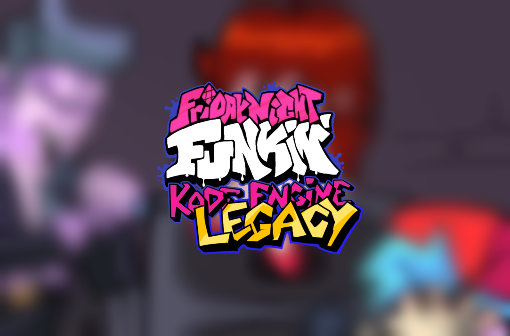

# Friday Night Funkin': Kade Engine Legacy

## Friday Night Funkin'
**Friday Night Funkin'** is a rhythm game originally made for Ludum Dare 47 "Stuck In a Loop".

Links: **[itch.io page](https://ninja-muffin24.itch.io/funkin) ⋅ [Newgrounds](https://www.newgrounds.com/portal/view/770371) ⋅ [source code on GitHub](https://github.com/ninjamuffin99/Funkin)**

## Kade Engine
**Kade Engine** is a mod for Friday Night Funkin', including a full engine rework, replays, and more.

Links: **[GameBanana mod page](https://gamebanana.com/gamefiles/16761) ⋅ [play in browser](https://funkin.puyo.xyz) ⋅ [latest stable release](https://github.com/KadeDev/Kade-Engine/releases/latest) ⋅ [latest development build (windows)](https://ci.appveyor.com/project/KadeDev/kade-engine-windows/branch/master/artifacts) ⋅ [latest development build (macOS)](https://ci.appveyor.com/project/KadeDev/kade-engine-macos/branch/master/artifacts) ⋅ [latest development build (linux)](https://ci.appveyor.com/project/KadeDev/kade-engine-linux/branch/master/artifacts)**

## Kade Engine Legacy
**Kade Engine Legacy** is an updated Kade Engine 1.5.2 with a lot of new stuff!

Links: **[Gamebanana mod page]() ⋅ [latest stable release](https://github.com/Goldie5fnf/Kade-Engine-Legacy/releases/latest)**

**REMEMBER**: This is a **mod**. This is not the vanilla game and should be treated as a **modification**. This is not and will never be official, so don't get confused.

## How to build KEL?

### If you want to build Kade Engine Legacy, read [this](https://github.com/Goldie5fnf/Kade-Engine-Legacy/blob/main/docs/building.md).

# Features

 - **Based on KE 1.5.2**
    - To be honest, the best version of Kade Engine.
 - **New Updated HUD**
    - Middle Scroll, New Song Position, and more with the new HUD!
 - **GPU Render**
    - You can load sprites with GPU instead of RAM, that can boost your FPS!
 - **Optimization**
    - A lot of stuff to make the game work better!
 - **Note Splashes**
    - Note Splash when pressing sick!
 - **No Default Weeks**
    - You can start coding without deleting them.
 - **Clear Code**
    - No comments and another stuff that can be useless!
 - **New Settings Menu**
    - Settings menu from KE 1.8!
 - **Separated Vocals Support**
    - You can put playerVoice.ogg and enemyVoice.ogg to use separated vocals!
 - **MP4 Videos Support**
    - You can use MP4 videos!
 - **And Much More!**
    - We added a lot of stuff to make Kade Engine better!

# Credit
### Friday Night Funkin'
 - [ninjamuffin99](https://twitter.com/ninja_muffin99) - Programming
 - [PhantomArcade3K](https://twitter.com/phantomarcade3k) and [Evilsk8r](https://twitter.com/evilsk8r) - Art
 - [Kawai Sprite](https://twitter.com/kawaisprite) - Music

This game was made with love to Newgrounds and its community. Extra love to Tom Fulp.
### Original Kade Engine
- [KadeDeveloper](https://twitter.com/KadeDeveloper) - Maintainer and lead programmer
- [The contributors](https://github.com/KadeDev/Kade-Engine/graphs/contributors)

### Kade Engine Legacy
- [Goldie_5](https://youtube.com/@goldie-5250) - Main Programmer
- [Shyllis](https://www.twitter.com/dolpshy) - Programmer
- [Makit](https://youtube.com/@makit8854) - Artist
